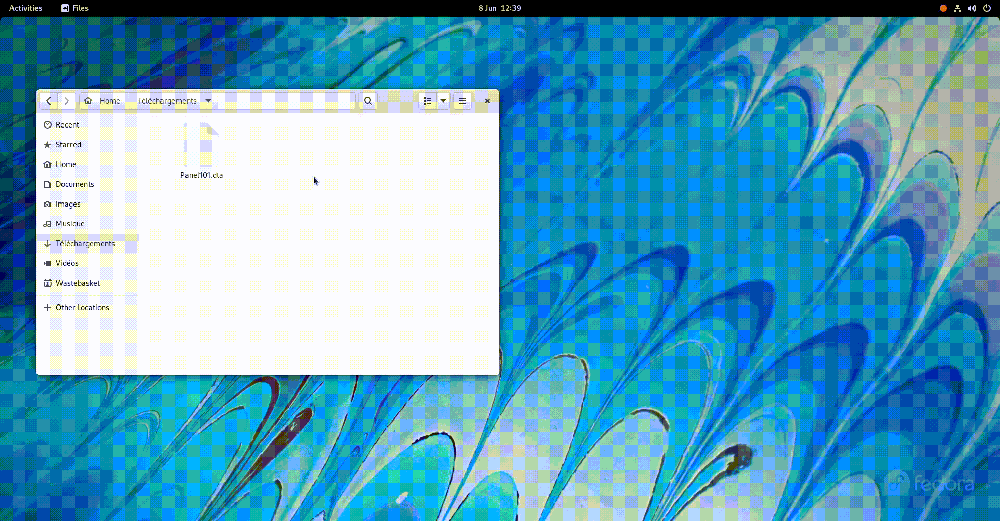

# MetaDatViewer

*A desktop app for viewing metadata from binary encoded statistics data files*


## Description

[MetaDataviewer](#MetaDataviewer) is a simple Gtk4 based desktop app.

For the moment only `.dta`(STATA) files are supported.

Here's an example of the app when opening a stata file.



**Note:** 
 
 The dataset displayed in this example comes from url: http://dss.princeton.edu/training/Panel101.dta  mentionned in:
 - Oscar Torres-Reyna (2007). Panel Data Analysis
 Fixed and Random Effects using Stata, Economics Department, Princeton. https://www.princeton.edu/~otorres/Panel101.pdf


## Building the Flatpak package

```console
[user@desktop Repositories]$ git clone https://github.com/sondalex/metadatviewer.git
[user@desktop Repositories]$ cd metadatviewer
```

```console
[user@desktop metadatviewer]$ flatpak-builder <build-dir> io.github.sondalex.MetaDatViewer.json
```


```console
[user@desktop metadatviewer]$ flatpak-builder --repo=<repo> --force-clean <build-dir> io.github.sondalex.MetaDatViewer.json
```

Note that repo does not refer to the repository of source code.
Simplifying it is a directory to store an intermediate representation of the build (prior single build building). 

Package in a single-file bundle:

```console
[user@desktop metadatviewer]$ flatpak build-bundle  <repo> <bundle-location.flatpak> io.github.sondalex.MetaDatViewer
```

## Installing the Flatpak package

The single bundle file <bundle-location.flatpak> can be installed by opening it
with the gui-software installer of your linux based distribution or from the cli:

```console
[user@desktop metadatviewer]$ flatpak install --user <bundle-location.flatpak>
```


## Contributions

New features, issue reports and packaging to non-linux based OS are more than
welcome.
 
## Development

Testing the flatpak

Build if not already built

```console
flatpak-builder build --force-clean io.github.sondalex.MetaDatViewer.json
```

```console
flatpak-builder --user --install --force-clean build io.github.sondalex.MetaDatViewer.json
```

```console
flatpak run io.github.sondalex.MetaDatViewer
```
